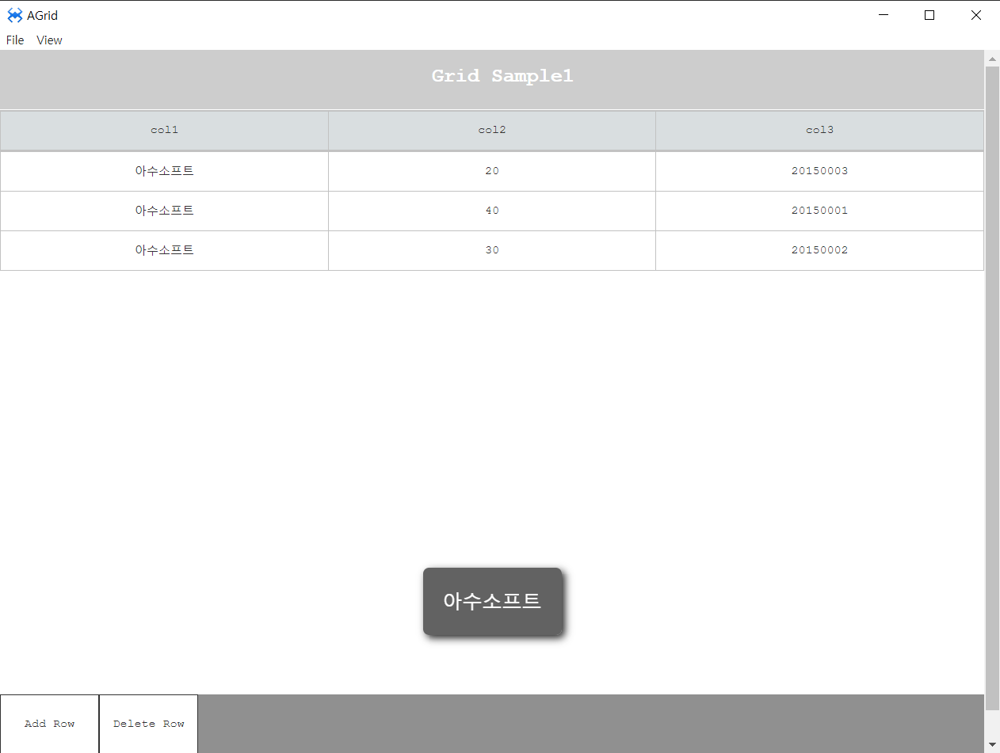

# N. Grid

## a. Grid Attribute

### **Option**<br>
* **Hide Header** header 숨김 여부 옵션입니다
* **Hide Footer** footer 숨김 여부 옵션입니다.
* **Fullrow Select** 특정 cell 을 클릭해도 그 row 전체가 선택되는 옵션입니다.
* **Single Select** ctrl 키를 누르고 선택해도 하나만 선택되는 옵션입니다. 
* **Flexible Row**TR의 높이를 TABLE 높이에 풀로 맞추는 옵션입니다.
* **Selectable** 선택 [불]가능 옵션 플래그입니다.
* **Clear Row Templa** 그리드 초기화 후 Template 로우를 그대로 보존할 지에 대한 옵션입니다
* **Sortable** 헤더 선택시 정렬처리 여부 옵션입니다

**Columm Resize**
* **Columm Resize**<br> 컬럼 리사이즈 여부 옵션입니다
* **Width Changable**<br> 컬럼 리사이즈시 그리드 넓이 변경 여부 옵션입니다


## b. Grid Example

### 1. MainView의 레이아웃에 컴포넌트를 추가합니다.<br>
 * grid id : gridID 로 설정해줍니다.
<br>

<br>
 * 위의 사진을 참고하여 옵션을 변경해줍니다.

### 2. Data Properties 설정하기
 * grid를 더블클릭해서 Data properties 를 오픈합니다.
 
<br>
 * Column : 2<br>
 * Cell > Width :40 , Height : 40
 * 셀을 직접 클릭하여 text를 위와 같이 설정해줍니다.


 ### 3.소스코딩을 이용하여 Grid에 텍스트를 설정합니다.
 ```
 
function MainView*onInitDone()
{
	super.onInitDone();
	
	this.gridID.setCellText(1,0, "3명");
	this.gridID.setCellText(1,1, "5명");
	

};
 
 ```

### 5.F5를 누르거나 Build > Run Project 를 클릭하여 프로젝트를 Run 합니다.<br>

<br>